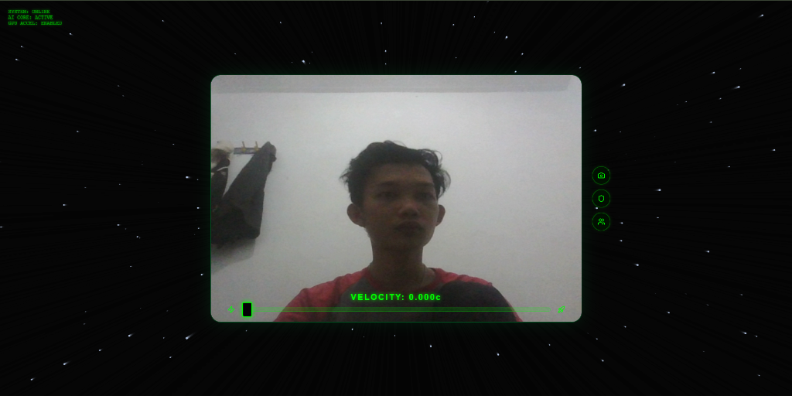
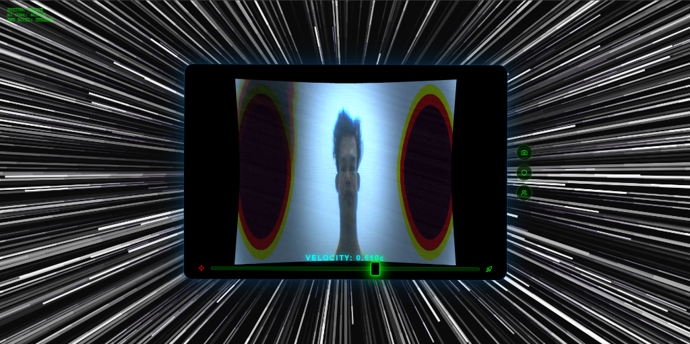
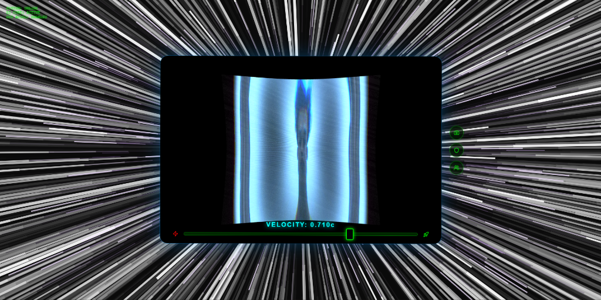
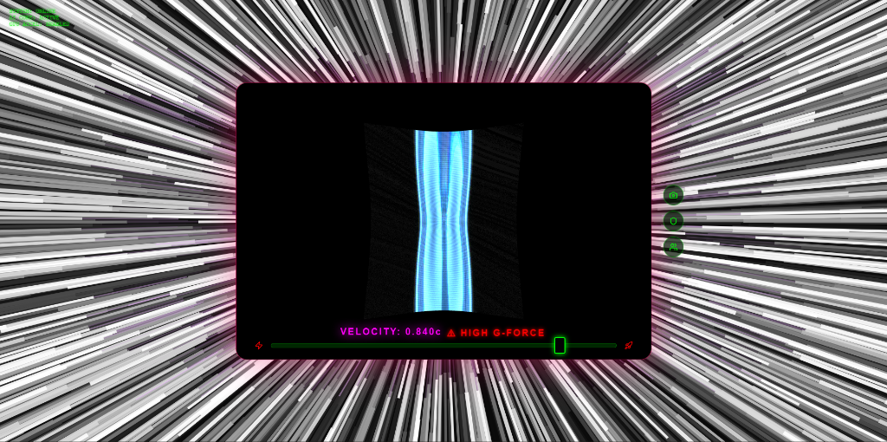

# WrapFaceAI - Simulasi Ruang Waktu Relativistik (CGI Level)

**WrapFaceAI** adalah aplikasi web eksperimental tingkat lanjut yang menggabungkan **pelacakan wajah AI secara real-time** dengan **True 3D Cinematic WebGL Shader** dan **Web Audio API** dinamis. Aplikasi ini secara harfiah mensimulasikan fisika benda yang bergerak mendekati kecepatan cahaya (Teori Relativitas Khusus Albert Einstein) layaknya adegan film *Interstellar* langsung di dalam browser Anda.

Semua pemrosesan, baik kecerdasan buatan (AI) maupun grafika 3D, dilakukan 100% di sisi klien (Client-Side) secara lokal untuk menjamin privasi dan latensi sangat rendah.

   

---

## Cinematic Progression (Kecepatan Cahaya)

Seiring tuas kecepatan (*velocity slider*) dinaikkan, WrapFaceAI mensimulasikan efek visual G-Force dan kelengkungan dimensi secara bertahap:

### 1. Velocity Normal (0.000c)
*Kondisi ruang-waktu normal. Grid dan reticle aktif, AI melacak pergerakan wajah secara real-time.*


### 2. Akselerasi Menengah
*Bintang-bintang mulai memanjang membentuk garis lintasan (Particle Streaks), dan efek Aberasi Kromatik (Pemisahan spektrum RGB) mulai muncul di pinggiran corong visual.*


### 3. Distorsi Relativistik
*Hukum Lorentz mulai memipihkan ruang secara horizontal, warna memudar menjadi biru pekat, pinggiran lensa dilingkupi bayangan hitam gravitasi (Event Horizon).*


### 4. Extreme G-Force & 3D Warp
*Layar terguncang hebat (Cinematic Turbulence). Bidang koordinat wajah ditarik masuk ke sumbu kedalaman (Z-Axis) negatif membentuk corong dimensi. Audio mendengung ekstrem!*


---

## Teori Fisika & Matematika yang Diaplikasikan

Aplikasi ini mendasarkan keseluruhan *shader* 3D dan *audio engine*-nya pada rumus fisika nyata yang dikonversi menjadi algoritma matematika di dalam kode:

### 1. Faktor Lorentz ($\gamma$)
Faktor Lorentz digunakan untuk menghitung seberapa besar distorsi ruang yang dialami oleh pengamat. Dalam kode (TypeScript), ini dihitung sebelum dikirim ke GPU:
$$ \gamma = \frac{1}{\sqrt{1 - \frac{v^2}{c^2}}} $$
*Di mana $v$ adalah kecepatan (*velocity slider*), dan $c$ dinormalisasi menjadi 1.*

### 2. Kontraksi Panjang Fisik (Lorentz Contraction 3D)
Benda yang bergerak sangat cepat akan tampak memendek (gepeng) searah dengan arah gerakannya. Di dalam *Vertex Shader*, *PlaneGeometry* padat (*128x128 vertices*) dimanipulasi secara fisik pada sumbu X menggunakan:
$$ L = L_0 \sqrt{1 - v^2} $$
```glsl
// Kode Vertex Shader
float contraction = sqrt(1.0 - pow(uSpeed, 2.0));
newPosition.x *= contraction;
```

### 3. Parabolic Spacetime Funnel (Kelengkungan Dimensi Z-Warp)
Ruang visual ditarik masuk menembus kedalaman layar (sumbu Z negatif) dengan simulasi efek *wormhole funneling* berdasarkan jarak radial ke titik pusat layar:
$$ Z_{warp} = - \frac{v^3 \times 800}{(d + 0.2)} $$
```glsl
// Kode Vertex Shader
float dist = length(uv - 0.5) * 2.0;
float warpFactor = pow(uSpeed, 3.0) * 800.0;
newPosition.z -= (1.0 / (dist + 0.2)) * warpFactor;
```

### 4. Efek Doppler Relativistik (Pergeseran Biru/Merah)
Saat Anda bergerak mendekati sumber cahaya, gelombang memampat ke frekuensi tinggi (Blueshift). Saat menjauh, gelombang merenggang ke frekuensi rendah (Redshift). Kami mengkonversinya menjadi perubahan filter RGB (*Neon Tinting*):
$$ f_{obs} = f_{emit} \sqrt{\frac{1 + \beta}{1 - \beta}} $$
Dalam simulasi ini, matriks `dopplerFactor` dari *TensorFlow FaceMesh* diubah menjadi interpolasi warna merah dan biru pekat pada *Fragment Shader*.

### 5. Filter Frekuensi Doppler Audio (Web Audio DSP)
Sama halnya dengan cahaya, gelombang suara dimodifikasi menggunakan algoritma *Biquad Filter* berdasarkan vektor kecepatan kepala Anda:
- **Blueshift (Maju):** $f_{highpass} = 1000 + (D \times 5000) \text{ Hz}$
- **Redshift (Mundur):** $f_{lowpass} = 400 - (|D| \times 300) \text{ Hz}$

### 6. Relativistic Particle Acceleration (Hyperspace)
Laju partikel bintang di sekeliling Anda (yang ditarik di `StarfieldCanvas`) tidak bertambah secara linear, melainkan secara eksponensial pangkat 4 saat mendekati kecepatan cahaya, mensimulasikan efek tarikan ruang:
$$ V_{star} = 1 + (v^4 \times 800) $$

---

## Fitur Utama

### 1. True 3D Cinematic Pipeline (WebGL/Three.js)
Jantung visualnya telah berevolusi dari 2D Shader biasa menjadi **3D Vertex Manipulation**:
- **Dense Mesh Projection**: Memproyeksikan video web-cam ke atas kanvas *PlaneGeometry* berisi 16.384 *vertex* secara *real-time*.
- **Perspective Z-Warping**: Bukannya memanipulasi gambar 2D, shader secara harfiah mendorong koordinat 3D ke belakang layar, menciptakan ilusi lorong (*Wormhole*) nyata.
- **Gravitational Vignette & Aberration**: Cincin kegelapan absolut dan pergeseran ekstrem *Channel RGB* ketika kecepatan mendekati kecepatan cahaya.

### 2. AI Doppler Tracking (TensorFlow.js)
Memanfaatkan MediaPipe FaceMesh untuk:
- Mengukur diferensial area (*bounding box*) wajah.
- Menerjemahkannya menjadi matriks percepatan (maju/mundur) yang menyetel efek suara dan visual *Doppler* seketika.

### 3. Web Audio API (Doppler Engine)
Efek audio ruang angkasa tanpa file `.mp3`, murni pemrosesan DSP:
- **Doppler Filter**: Suara mendadak melengking cempreng (highpass) saat kepala maju, bergema *bass* (lowpass) saat mundur.
- **Space Reverb & Stutter**: Suara terputus-putus (*tremolo glitch*) dan bergema hebat layaknya transmisi sinyal alien saat *slider* menyentuh `0.90c`.
- **Hyperdrive Hum**: Osilator bass berat (*Sawtooth*) menderu, dari `40Hz` hingga melengking tajam di kecepatan puncak.

### 4. Mode Tantangan & Telekonferensi P2P
- Dapatkan **Sertifikat Spacetime** saat bertahan menghadapi *High G-Force*.
- **Spacetime Duet (WebRTC)**: Hubungi teman *peer-to-peer* dan biarkan mereka menonton distorsi Anda dari zona "waktu normal".

---

## Pembahasan Teknis & Bugfixes

- **Mencegah GPU Context Starvation**: AI TensorFlow.js dipaksa berjalan pada *backend CPU* (WASM) untuk FaceMesh. GPU 100% didedikasikan untuk komputasi berat 16K+ Vertex WebGL secara simultan pada 60FPS.
- **Hardware-Accelerated VideoTexture**: Menggunakan pemetaan `THREE.VideoTexture` murni dengan `LinearFilter` dan `SRGBColorSpace` untuk mem-bypass macetnya GPU *driver* Windows ketika mendeteksi *NPOT (Non-Power Of Two) Textures*.
- **Cinematic Shake Math**: Bukannya menggunakan CSS animasi yang datar, goncangan layar dilakukan dengan matematika murni pada `camera.position.x/y` di Three.js yang memberikan guncangan *depth* realistis.

---

## Instalasi & Menjalankan

1. **Clone repositori ini:**
   ```bash
   git clone <repo-url>
   cd WrapFaceAI
   ```
2. **Instal seluruh dependencies:**
   ```bash
   npm install
   ```
3. **Jalankan server:**
   ```bash
   npm run dev
   ```
4. **Kompilasi produksi:**
   ```bash
   npm run build
   ```

*Pastikan browser Anda mengizinkan akses Kamera & Mikrofon untuk simulasi Doppler!*
